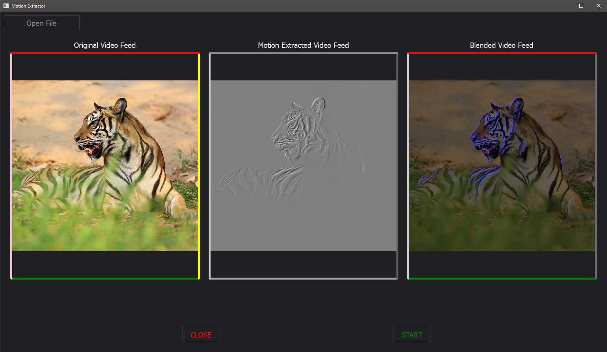
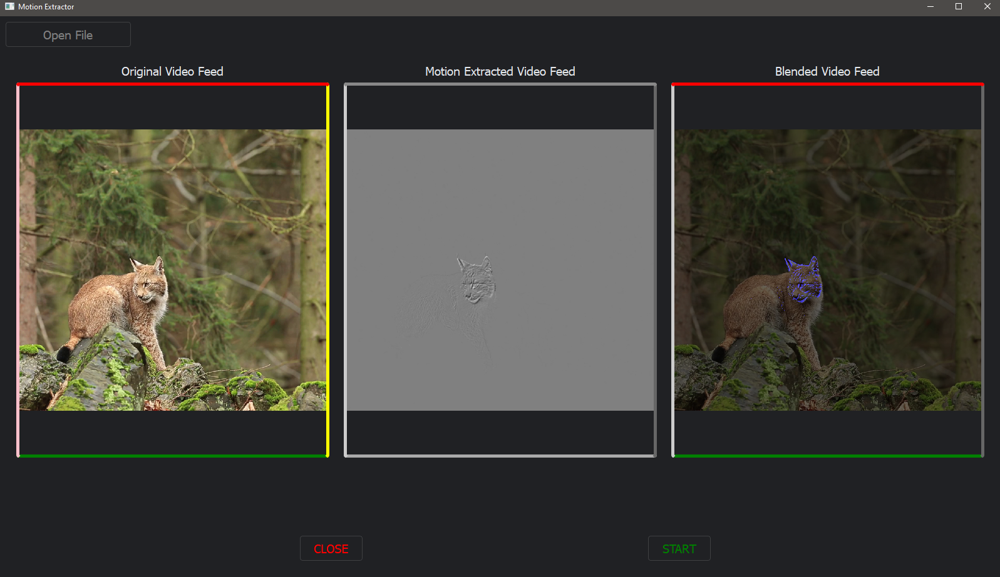

# Video-Based Motion Extraction and Amplification


## Problem Statement:

Develop a system to extract and enhance otherwise invisible motion from a video, or a
live video feed.

## To Run
1) Create a python virtual environment and activate it via the activate scripts present in bin folder, depending on your shell.
2) Install the relevant version of pytorch for your system from: https://pytorch.org/get-started/locally/
3) Install dependencies and requirements by running:  
   ``` pip install -r requirements.txt```
4) For MotionExtraction, navigate to src directory and run either app.py code for the GUI app or the posy.py code for a direct experience with the source code.
5) For PhaseBasedAmplification, run the main.py code.

## UI

Some Big cats moving ever so slightly, and their motion extracted, in contrast to the still background





## Motivation:

To be comfortable with theoretical concepts of image processing through their pragmatic
usage in real-world applications.

## Objectives:

1) To reveal temporal variations in videos that are difficult or impossible to see with the naked eye and display them in
an indicative manner.
2) Motion with low spatial amplitude, while
hard or impossible for humans to see, can be magnified to reveal
interesting mechanical behavior.
3) To visualize the flow
of blood as it fills the face and also to amplify and reveal small
motions.
    
## Applications in Real world:

1) To measure the pulse rate, or breathing rate, of people (or animals) using non
intrusive methods, and without physical contact.
2) Detection and amplification of vibrations in mechanical equipment to identify potential
faults and facilitate timely maintenance.
3) Amplify and analyze the motion of celestial bodies or phenomena, aiding astronomers
in studying subtle changes in the night sky.
4) To use as a video special effect for motion pictures, or social media.

## IP Algorithm/Concept to be used:


1) Phase-Based Video Motion Processing:
Phase variations of the coefficients of a complex-valued steerable
pyramid over time correspond to motion, and can be temporally
processed and amplified to reveal imperceptible motions, or atten-
uated to remove distracting changes.In comparison to the pre-
vious Eulerian Video Magnification method it supports larger am-
plification factors and is significantly less sensitive to noise. 

## Choice of Programming Language:

1) Python


The jupyter notebooks in the root of the tree are for demonstration purposes. Appropriate python code is available in each project's folder, as shown above.

## To Build (Using PyInstaller)
Ensure that the ```pyinstaller``` package is installed. It can be installed  
1) via pip:
```pip install pyinstaller```

Navigate to the top level of the src directory of your desired project. Execute the following command in the virtual environment:
```pyinstaller --onefile src/app.py```  

The executable will be built in the dist folder newly created.


## References:

1) Phase-Based Video Motion Processing: 
Neal Wadhwa, Michael Rubinstein, Fr´edo Durand, William T. Freeman  
https://dl.acm.org/doi/10.1145/2461912.2461966
    
2) Motion Extraction Video by Posy( https://www.youtube.com/watch?v=NSS6yAMZF78 )

3) Reveal Invisible Motion With This Clever Video Trick by Steve Mould
(https://www.youtube.com/watch?v=rEoc0YoALt0 )
